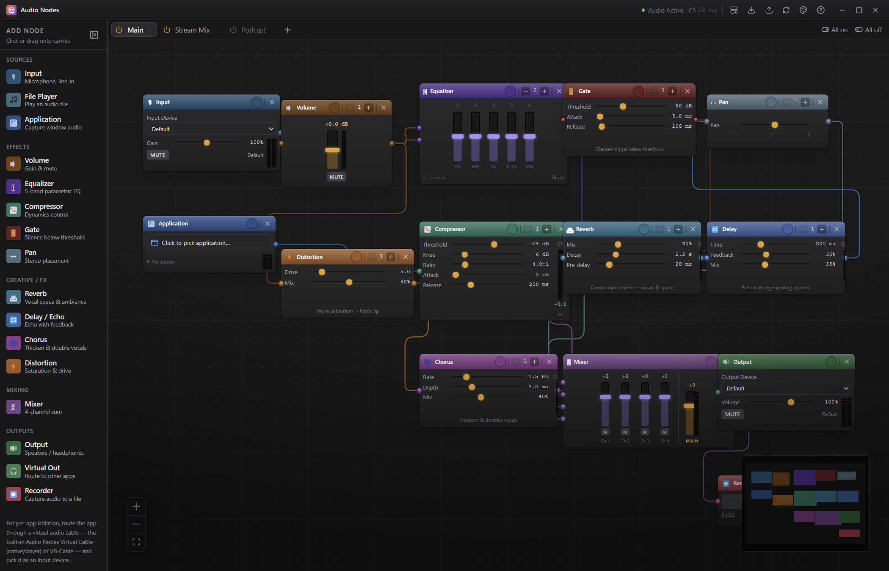

# 🎛 Audio Nodes

A node-based audio router & mixer for Windows — a fully customizable, Blender-style
alternative to the Windows volume mixer and tools like Voicemeeter. Wire **inputs**
(mics, line-in, virtual cables, per-app/window capture) through **effects** into
**outputs**, all on a visual canvas.



## ▶ Quick start (easiest)

**Double-click `start.bat`.**

On the first run it installs everything it needs and then opens the app; after that it
just launches. You don't need to touch a terminal.

> Prefer PowerShell? Right-click `start.ps1` → **Run with PowerShell**.

## ▶ Start from a terminal

```bash
npm install   # first time only
npm start     # opens the app (hot-reload dev build)
```

| Command | What it does |
| --- | --- |
| `npm start` / `npm run dev` | Launch the app with hot reload |
| `npm run build` | Build to `out/` |
| `npm run preview` | Run the production build from `out/` |

## ✅ Requirements

- **[Node.js](https://nodejs.org) 18+** (LTS recommended) — bundles `npm`.
- **Windows 10/11** — window capture, `setSinkId` output routing and the virtual-cable
  driver are Windows-focused (the app runs elsewhere, but those features may not).

No global tooling is required for the default build; everything installs via `npm install`.

## 🎚 What's inside

- **Sources** — Input (mic / line-in), **File Player** (play a local audio file),
  Application (capture a window's audio)
- **Effects** — Volume, 5-band Equalizer, Compressor, Gate, Pan
- **Creative / FX** — Reverb, Delay/Echo, Chorus, Distortion (great for vocals & karaoke)
- **Mixing / Out** — 4-channel Mixer, **Output** (physical device),
  **Virtual Output** (route the mix into a virtual cable), **Recorder** (capture to a file)

Effect nodes are **multi-channel** (1–8 independent signal paths via the −/+ in the node
header — channel 0 never bleeds into channel 1). Sockets and wires are **color-coded by
node type** so signal flow is easy to trace.

## 🗂 Workspaces (tables)

The tabs above the canvas are **independent node graphs**. Each has its own **enable/disable
toggle**, so several can run **in parallel** (keep one routing while you build another), or
sit disabled and silent. Rename, add, delete, and bulk **All on / All off**. Everything is
saved automatically and restored next launch.

## 🪟 Runs in the system tray

Audio Nodes is a background audio router: **minimize or close** and it drops to the **system
tray**, still routing audio while the UI and meters pause (so it barely uses any resources).
Click the tray icon to bring it back; **Quit** from the tray menu to fully exit.

## 🔌 Routing to / from other apps (virtual cable)

A real OS-level virtual device needs a **driver** — Windows won't let an app invent endpoints.
Audio Nodes ships its own, the **Audio Nodes Virtual Cable** (a virtual *speaker* + *mic*
pair), built from source in [`native/driver/`](native/driver/README.md). Or use
[VB-Audio Virtual Cable](https://vb-audio.com/Cable/).

- **Send your mix out:** a **Virtual Output** node plays into the cable (Playback); pick the
  cable (Recording) as the microphone in Discord / OBS / a game.
- **Pull audio in:** set another app's speaker to the cable (Playback); add an **Input**
  node on the cable (Recording) to bring that audio into your graph.

> Building the driver needs Visual Studio 2022 + the Windows Driver Kit, and (for your own
> machine) test signing. See [`native/driver/README.md`](native/driver/README.md). It's a
> rebrand of the MIT [`VirtualDrivers/Virtual-Audio-Driver`](https://github.com/VirtualDrivers/Virtual-Audio-Driver),
> vendored as a git submodule — run `git submodule update --init --recursive` after cloning.

## ⚡ Engines: Native (Rust) & Web Audio

Audio Nodes runs on a **native Rust audio engine** (`native/audio-engine/`) by **default**, for
lower overhead and real device-latency reporting. The **Web Audio** engine is the fully-featured
fallback — switch between them anytime in the Theme panel.

```bash
npm run build:native     # compile the Rust addon (needs the Rust toolchain)
```

- If the addon **isn't built**, the app **transparently uses Web Audio** for that session — so
  `start.bat` always has sound; build the addon to unlock the native engine.
- A few features are **Web Audio-only** for now and are clearly disabled on native: the
  **File Player**, **recording to a file**, and **application capture**. The native engine also
  expects input/output at the same sample rate (e.g. 48 kHz). These are being ported.

## 🎨 Theming

Open the palette button in the toolbar:

- **Simple** — pick one accent color; background, panels, text and a node palette are derived.
- **Advanced** — fine-tune every interface token and each node color.
- **Picture** — generate a palette from an image (optionally shown as the canvas background).

There's also a **node-scale** slider, a collapsible add-node rail, and per-node recolor (click
the color dot in a node header; right-click to reset).

## 🧩 Workflow

- **Presets** (toolbar) — one-click starting graphs: Mic→Speakers, Podcast, Karaoke, Streaming.
- **Export / Import** (toolbar) — save the whole config (all workspaces + theme) to a `.json`.
- **Guide** (toolbar `?`) — an in-app visual walkthrough.
- **Latency** — the toolbar shows estimated input→output latency.
- **Auto-recovery** — dropped input devices reconnect when they return; outputs re-bind their device.

## 🧪 End-to-end checks

```bash
npm run build
node scripts/check-errors.mjs   # adds every node type, asserts no console errors/warnings
node scripts/screenshot.mjs     # wires a demo graph, writes screenshots/
```

## 🛠 Stack

Electron + electron-vite · React 18 + TypeScript (strict) · @xyflow/react (canvas) · Zustand ·
Web Audio API · Tailwind CSS · (optional) Rust + napi-rs engine · (optional) WDM/PortCls driver

## 📁 Project layout

```
src/
  main/        Electron main process (window, tray, desktopCapturer, native-engine IPC)
  preload/     Context-isolated IPC bridge
  renderer/src/
    audio/        AudioEngine (Web Audio) + NativeEngine (Rust IPC) behind an AudioBackend seam
    components/   Toolbar, Sidebar, WorkspaceBar, NodeEditor, ThemePanel, VU meters, nodes/
    lib/          color/theme math, node colors, persistence
    store/        Zustand stores (audio graph + workspaces, settings/theme)
native/
  audio-engine/  Rust napi-rs audio engine (beta; build with npm run build:native)
  driver/        Audio Nodes Virtual Cable — fork+rebrand of an MIT virtual audio driver
scripts/         Playwright e2e (screenshot + error check)
```

## 📄 License

[MIT](LICENSE). The vendored driver under `native/driver/vendor/` is MIT (see its `LICENSE`).
